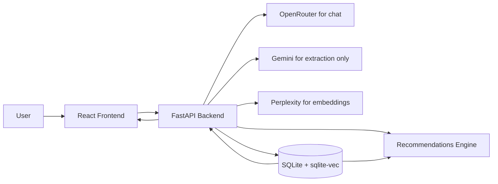
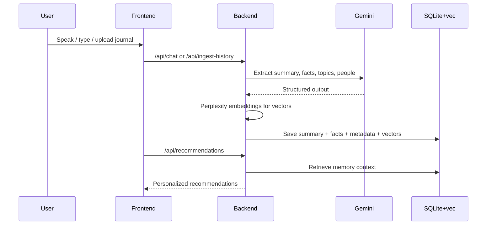
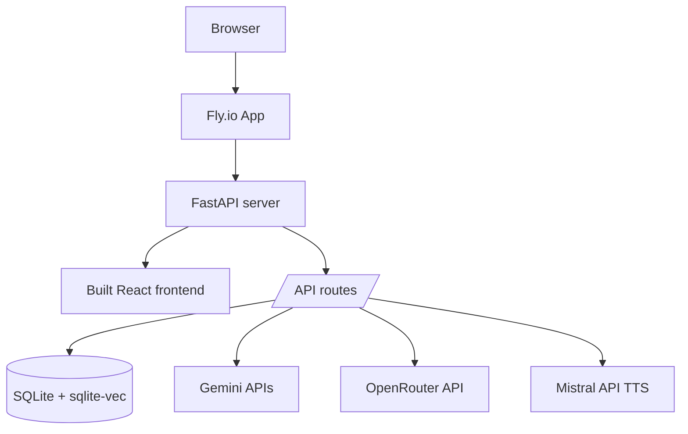

# Selfmeridian

Selfmeridian is an AI journaling app that lets someone talk, type, or upload past journal entries and turn them into searchable memory, personalized recommendations, and long-term reflection tools.

It is designed to work as both:

- a clear introduction to what the app does and why it is built this way
- a practical reference for architecture, data flow, environment variables, and deployment

**By:** John S., Sherelle M., Aniyah T., Dominique S., Andy C., Jackeline G.

---

## What This App Does

At a high level, Selfmeridian helps a user:

1. Talk to an AI journaling assistant.
2. Save that conversation in local history.
3. Extract useful memory from the journal entry.
4. Use that memory later for better conversations and recommendations.

### In plain English

Think of the app as three systems working together:

- **Conversation system**: lets the user talk or type to the AI.
- **Memory system**: pulls out important facts, topics, people, and summaries from journal entries.
- **Recommendation system**: uses what the user has journaled about to suggest books, podcasts, articles, and research papers.

The goal is not just "chat with an AI." The goal is to build a journal that becomes more useful over time.

---

## How To Read This README

If you want a fast conceptual overview, start with:

- `What This App Does`
- `How It Works`
- `Quick Start`
- `Common Workflows`

If you want the implementation and deployment details, jump to:

- `Architecture`
- `Project Structure`
- `Environment Variables`
- `Backend API`
- `Deployment on Fly.io`

---

## Core Features

- **Voice journaling**: Browser speech recognition and dictation; server STT via OpenRouter; TTS via Mistral Voxtral when `MISTRAL_API_KEY` is set.
- **Text journaling**: Type messages directly to the AI assistant.
- **Automatic memory sync**: Journal entries in History are synced to backend memory so recommendations and later chats can use them.
- **Memory view**: Inspect or edit stored facts and summaries.
- **People graph**: Extract and visualize relationships and recurring people from journals.
- **Recommendations**: Generate book, podcast, article, and research suggestions based on journal content and consumed items. You can record what you’ve read or listened to (and whether you liked it) either by talking about it in the Recommendations session mode or by marking items as consumed in the UI; that feedback is stored and used to improve future suggestions.
- **Library**: Track what you’ve consumed and add notes; the recommendation engine uses this to avoid repeats and to better match your tastes. Richer feedback (via the interviewer or manually) leads to more personalized results—and there’s room to explore more sophisticated personalization algorithms in future versions.
- **Calendar summaries**: Generate a summary for a specific day from journal history and stored memory.
- **Import / export**: Upload old journals or download the journal archive.
- **Optional login**: The app can be used without an account, but users can also log in for account-based persistence.

---

## How It Works

### Plain-language overview

When a user journals:

1. The browser records what they said or typed.
2. The AI responds.
3. The transcript is saved in the History tab.
4. The backend tries to extract:
   - key facts
   - important events
   - people
   - topics
   - emotions
   - a compact summary
5. That extracted data is stored in a SQLite database with vector search.
6. Later, the app uses that stored memory to personalize chat and recommendations.

### System diagram



### Journal-to-memory flow



---

## Tech Stack

| Layer | Main Tools | What It Does |
|---|---|---|
| Frontend | React, Vite, Tailwind, React Router | UI, session controls, history, memory, recommendations |
| Voice / TTS | Mistral Voxtral, OpenRouter STT | Read-aloud and Assisted Journal voice mode (TTS); transcription via OpenRouter |
| Main backend | FastAPI, LangGraph | Chat routes, memory sync, recommendations, auth, ingest |
| Memory layer | SQLite, sqlite-vec | Persistent journal memory and vector search |
| AI models | Perplexity, Gemini, OpenRouter | Perplexity for vector embeddings; Gemini or OpenRouter for extraction/helpers; OpenRouter for `/chat` (default GPT 5.4) |
| Optional extras | LightRAG, Tavily, Semantic Scholar, Listen Notes | RAG, web/news search, paper lookup, podcast links |

### OpenRouter

- **OpenRouter** powers the journal **`/chat`** interviewer (default model `openai/gpt-5.4` via `OPENROUTER_CHAT_MODEL`), plus journal validation and (when enabled) extraction/helpers alongside **Gemini**.
- Set **`OPENROUTER_API_KEY`** in `.env` for chat to work.

---

## Quick Start

### What you need

- **Node.js 18+**
- **Python 3.11 recommended**
- API keys for:
  - `OPENROUTER_API_KEY`
  - `GEMINI_API_KEY` (or rely on OpenRouter for extraction if configured)
  - `MISTRAL_API_KEY` (for `/api/voice` TTS)

Python 3.11 is strongly recommended because some optional libraries are awkward on Python 3.9.

### 1. Install frontend dependencies

From the project root:

```bash
npm install
```

### 2. Create your environment file

Copy `.env.example` to `.env` in the project root.

Minimum useful setup:

```env
OPENROUTER_API_KEY=your_openrouter_key
GEMINI_API_KEY=your_gemini_key
MISTRAL_API_KEY=your_mistral_key
```

If you want login support:

```env
JWT_SECRET=some_long_random_secret
```

### 3. Start the Python backend

From `backend/`:

```bash
python3 -m venv .venv
source .venv/bin/activate
pip install -r requirements.txt
.venv/bin/python -m uvicorn main:app --reload --port 8000
```

Useful URLs:

- API: `http://localhost:8000`
- API docs: `http://localhost:8000/docs`

### 4. Start the frontend

In a second terminal from the project root:

```bash
npm run dev
```

Then open:

`http://localhost:5173`

### 5. Start journaling

Once the frontend and backend are running:

1. Open the app.
2. Connect or type.
3. Journal normally.
4. Open History or Recommendations.

The app should sync unsynced history into backend memory automatically.

---

## Common Workflows

### A. Voice journaling

1. The user clicks connect.
2. The frontend gets a temporary speech token.
3. Speech is transcribed.
4. The backend generates a response.
5. The transcript is added to History.
6. The transcript is synced to memory.

### B. Uploading old journal entries

1. The user uploads a text or JSON file.
2. The app saves it into History.
3. The backend ingests it into the vector store.
4. Recommendations and later chats can use it.

### C. Personalized recommendations

1. The frontend makes sure History is synced.
2. The backend reads memory from SQLite.
3. The recommendation engine builds queries based on the user's themes and on **consumed-media feedback** (what you’ve marked as read/listened to and whether you liked it).
4. The app returns books, podcasts, articles, and research papers.

You can give that feedback in two ways: by talking about books and media in the **Recommendations** session mode (the interviewer records what you’ve consumed and your reactions) or by **manually** marking recommendations as consumed and liking/disliking them. The more you use either path, the better the suggestions get. This is also a promising area for future work—e.g. richer personalization, diversity, and exploration algorithms.

---

## Architecture

### High-level view

Selfmeridian is a **monolith on Fly.io**:

- FastAPI serves the API
- FastAPI also serves the built React frontend
- SQLite stores persistent memory
- The app uses same-origin `/api` requests in production

### Monolith deployment diagram



### Key architectural ideas

- **History and memory are different**:
  - History is the transcript the user sees in the browser.
  - Memory is the extracted, compressed information the backend saves for later use.
- **Personalization comes from memory**, not raw history cards.
- **Anonymous mode is supported**:
  - If the user is not logged in, the app uses an instance ID.
  - If the user logs in, account-based persistence can be used.

---

## Project Structure

```text
.
├── src/
│   ├── app.tsx
│   └── pages/Personaplex/
│       ├── Personaplex.tsx
│       ├── components/
│       ├── hooks/
│       └── utils/
├── backend/
│   ├── main.py
│   ├── auth.py
│   ├── graph.py
│   ├── library.py
│   ├── vec_store.py
│   ├── lightrag_bridge.py
│   ├── requirements.txt
│   └── Dockerfile
├── api/
│   ├── voice.ts
│   ├── voices.ts
│   ├── transcribe.ts
│   └── reformat.ts
├── scripts/
│   └── api-server.ts
├── public/
├── .env.example
├── fly.toml
├── package.json
└── README.md
```

### What the main files do

- `src/pages/Personaplex/Personaplex.tsx`
  - Main UI, recommendations, history, memory tab behavior
- `src/pages/Personaplex/hooks/usePersonaplexSession.ts`
  - Live session handling for conversation and voice
- `src/pages/Personaplex/hooks/useJournalHistory.ts`
  - Browser-side journal history and sync tracking
- `backend/main.py`
  - FastAPI routes and deployment entrypoint
- `backend/graph.py`
  - LangGraph conversation/librarian flow
- `backend/library.py`
  - Extraction, memory logic, and recommendation helpers
- `backend/vec_store.py`
  - SQLite + vector DB storage layer

More backend-only detail (run, endpoints, Fly volume) is in **`backend/README.md`**.

---

## Environment Variables

### Required for the main app

| Variable | Purpose |
|---|---|
| `GEMINI_API_KEY` | Extraction and Gemini helpers when using direct Google SDK (not embeddings) |
| `PERPLEXITY_API_KEY` | Vector embeddings for gist / episodic / library (sqlite-vec) |
| `OPENROUTER_API_KEY` | Chat (`/api/chat`), journal validation; optional `OPENROUTER_CHAT_MODEL` (default `openai/gpt-5.4`) |
| `MISTRAL_API_KEY` | Text-to-speech (`/api/voice`) via Mistral Voxtral |

### Common optional variables

| Variable | Purpose |
|---|---|
| `JWT_SECRET` | Enables login / refresh-token auth |
| `OPENROUTER_CHAT_MODEL` | Override `/chat` model on OpenRouter (default `openai/gpt-5.4`) |
| `GEMINI_CHAT_MODEL` | Override backend Gemini model for helper tasks |
| `PERPLEXITY_EMBEDDING_MODEL` | e.g. `pplx-embed-context-v1-4b` (default) or `pplx-embed-v1-4b` |
| `EMBEDDING_DIM` | Must match stored vector length (default `2560` for full Perplexity 4B embeddings) |
| `LIGHTRAG_ENABLED` | Default off; set `true` to enable optional LightRAG (`lightrag_bridge.py`) |
| `VECTOR_DB_PATH` | SQLite DB path, especially important in production |
| `TAVILY_API_KEY` | Better article/news recommendations |
| `SEMANTIC_SCHOLAR_API_KEY` | Better research paper recommendations |
| `LISTENNOTES_API_KEY` | Podcast link enrichment |

### Legacy / convenience variables

| Variable | Purpose |
|---|---|
| `API_PORT` | Local Node API dev port |
| `VITE_API_URL` | Local proxy target |
| `VITE_BACKEND_URL` | Frontend build-time backend URL if needed |

---

## Backend API Overview

### Core routes

| Method | Path | Purpose |
|---|---|---|
| `POST` | `/api/chat` | Main journaling conversation |
| `POST` | `/api/end-session` | Extract and save memory from the active session |
| `POST` | `/api/ingest-history` | Import past journal text into memory |
| `POST` | `/api/infer-entry-date` | Guess the date of an imported journal |
| `GET` | `/api/memory-stats` | Quick memory counts |
| `GET` | `/api/recommendations` | Personalized content recommendations |
| `POST` | `/api/recommendations/consumed` | Mark recommended content as consumed |
| `GET` | `/api/library` | Read stored library items |
| `POST` | `/api/library-notes` | Save notes about books/media |
| `POST` | `/api/calendar-day-summary` | Generate a day summary |
| `GET` | `/api/health` | Health check |

### Memory editing routes

| Method | Path |
|---|---|
| `GET` | `/api/memory/facts` |
| `GET` | `/api/memory/summaries` |
| `POST` | `/api/memory/facts` |
| `POST` | `/api/memory/summaries` |
| `PATCH` | `/api/memory/facts/{id}` |
| `PATCH` | `/api/memory/summaries/{id}` |
| `DELETE` | `/api/memory/facts/{id}` |
| `DELETE` | `/api/memory/summaries/{id}` |

### Auth routes

| Method | Path | Purpose |
|---|---|---|
| `POST` | `/api/register` | Register with email or username |
| `POST` | `/api/login` | Login |
| `POST` | `/api/refresh` | Refresh access token |
| `POST` | `/api/logout` | Clear refresh cookie |
| `GET` | `/api/me` | Current user |

---

## Deployment on Fly.io

Selfmeridian is deployed as a single app on Fly.io.

### Why this matters

That means:

- one deploy target
- one domain
- no frontend/backend CORS setup in production
- FastAPI serves both API and built frontend

### Deploy

From the project root:

```bash
fly deploy
```

### Important production settings

- The app must listen on `0.0.0.0`
- The app should use Fly's `PORT` env var
- SQLite should use a mounted volume in production

### Persistent memory on Fly

Fly containers are ephemeral by default, so the SQLite database must live on a volume.

Create the volume:

```bash
fly volumes create data --size 1 --region iad
```

Set the DB path:

```bash
fly secrets set VECTOR_DB_PATH=/data/open_journal.db
```

Then redeploy:

```bash
fly deploy
```

---

## Troubleshooting

| Issue | What to check |
|-------|----------------|
| **Recommendations feel generic** | Entries may be in History but not yet synced to backend memory. Open the Recommendations tab (sync runs automatically), or ensure `VECTOR_DB_PATH` is set and persistent (e.g. Fly volume). |
| **Memory stats stay at 0** | Backend needs `GEMINI_API_KEY` or OpenRouter extraction, plus `PERPLEXITY_API_KEY`, and `OPENROUTER_API_KEY` for `/chat`. On Fly.io, set `VECTOR_DB_PATH` to a path on a mounted volume so the SQLite DB persists across deploys. |
| **502 or app unreachable on Fly.io** | App must listen on `0.0.0.0` and use the `PORT` env var (see `backend/Dockerfile`). |
| **524 (timeout) in production** | Cloudflare (or another proxy) closes the connection when the origin doesn’t respond in time (~100s). The backend now times out ingest/recommendations before that. If you still see 524: increase the proxy’s **origin read timeout** to at least 100s, or use **DNS-only (grey cloud)** for this host so requests hit Fly.io directly. |
| **Voice or API not working locally** | Ensure both the Python backend (port 8000) and `npm run dev` (frontend + Node API proxy) are running. |

---

## Implementation notes

### Recommendations are only as good as memory

If recommendations seem generic, it usually means one of these is true:

- the transcript was saved in browser history but not ingested into backend memory
- extraction returned no usable facts or summary for that entry
- the DB path is wrong or not persistent

### Current model responsibilities

- **OpenRouter**: journal `/chat` conversation (default `openai/gpt-5.4`), journal validation, optional extraction
- **Perplexity**: vector embeddings for sqlite-vec (gist, episodic, library)
- **Gemini**: extraction, date inference, and helper generation when not routed via OpenRouter (not embeddings)
- **Mistral Voxtral**: text-to-speech for read-aloud and voice mode (`MISTRAL_API_KEY`)

### Optional or experimental pieces
- **LightRAG**: optional enrichment layer, not required for core memory sync

---

## Suggested Reading Order

If you are onboarding teammates or reading the project for the first time:

1. Read `What This App Does`
2. Read `How It Works`
3. Run `Quick Start`
4. Review `Architecture`
5. Review `Project Structure`
6. Dive into `backend/main.py`, `backend/library.py`, and `useJournalHistory.ts`

---

## License

MIT (see `LICENSE-MIT`).
