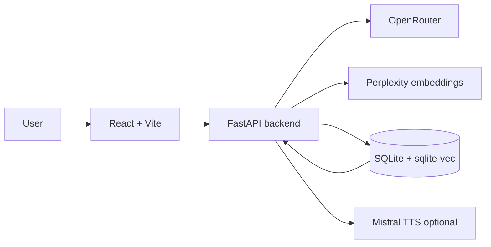

# SelfMeridian

SelfMeridian is a local-first journaling app: type, dictate, or import entries, chat with an AI assistant, and build searchable memory (SQLite + vectors) for richer follow-up conversations and recommendations.

This document is the **single source of truth** for setup, API keys, environment variables, and deployment. The Python backend loads `.env` from the **project root** (parent of `backend/`).

---

## Table of contents

1. [What you need](#what-you-need)
2. [Getting API keys](#getting-api-keys)
3. [Quick start (local)](#quick-start-local)
4. [Environment variables](#environment-variables)
5. [How the app is structured](#how-the-app-is-structured)
6. [Architecture](#architecture)
7. [Deployment (Fly.io)](#deployment-flyio)
8. [Troubleshooting](#troubleshooting)
9. [License](#license)

---

## What you need

| Requirement | Notes |
|-------------|--------|
| **Node.js 18+** | For Vite and the dev toolchain |
| **Python 3.11+** | Recommended for the FastAPI backend |
| **OpenRouter account** | Powers chat, speech-to-text (via multimodal models), transcript polish, and most LLM-backed helpers |
| **Perplexity API key** | Vector embeddings for memory (gist / episodic / library). Without it, embedding-related features degrade or use placeholders |
| **Mistral API key** | Optional; required only for **text-to-speech** (read-aloud / voice playback) via Mistral Voxtral |

You do **not** need separate API keys for OpenAI, Anthropic, or Google **if** you run those models **through OpenRouter** (one key, many providers).

---

## Getting API keys

### 1. OpenRouter (primary)

OpenRouter is an API gateway: one key can call models from OpenAI, Anthropic, Google, xAI, Meta, and others—billed through OpenRouter.

**Steps:**

1. Open **[openrouter.ai](https://openrouter.ai/)** and sign up or log in.
2. Go to **[openrouter.ai/keys](https://openrouter.ai/keys)** (or **Settings → Keys**).
3. Click **Create Key**, name it (e.g. `selfmeridian-dev`), and copy the secret. **Store it only in `.env`**—never commit it.
4. Add **credits** under **Credits** / billing if prompted (many models require a positive balance).
5. Browse **[openrouter.ai/models](https://openrouter.ai/models)** to see model IDs (e.g. `openai/gpt-4.1-mini`, `anthropic/claude-sonnet-4.6`). The app uses these strings in `OPENROUTER_*` overrides (see [Environment variables](#environment-variables)).

**Docs:** [OpenRouter quickstart](https://openrouter.ai/docs/quickstart)

**Optional headers** (some setups use them for rankings/analytics on OpenRouter’s side):

- `OPENROUTER_REFERER` (default in code: `https://selfmeridian.local`)
- `OPENROUTER_TITLE` (default: `SelfMeridian`)

### 2. Frontier providers (direct sites)—when you might use them

| Provider | Where to get a key | Typical use with SelfMeridian |
|----------|--------------------|--------------------------------|
| **OpenAI** | [platform.openai.com](https://platform.openai.com/) → API keys | Optional: **fallback** STT via `OPENAI_API_KEY` in some dev/Node transcribe paths—not the main backend path |
| **Anthropic** | [console.anthropic.com](https://console.anthropic.com/) | Not required if you use Anthropic models **via OpenRouter** |
| **Google (Gemini)** | [aistudio.google.com](https://aistudio.google.com/) | Not required for this repo’s default path; extraction/helpers use **OpenRouter** (`OPENROUTER_EXTRACTION_MODEL`, etc.) |
| **xAI (Grok)** | [console.x.ai](https://console.x.ai/) | Optional; Grok is often used **through OpenRouter** (e.g. `x-ai/grok-4.1-fast`) |

**Practical rule:** start with **only `OPENROUTER_API_KEY`**. Add Perplexity for memory vectors; add Mistral if you want TTS.

### 3. Perplexity (embeddings + search)

1. Open **[perplexity.ai](https://www.perplexity.ai/)** and sign in.
2. Open API settings: **[docs.perplexity.ai](https://docs.perplexity.ai/docs/getting-started/quickstart)** (API keys live in your account / developer settings).
3. Create an API key and set `PERPLEXITY_API_KEY` in `.env`.

Used for contextual embeddings (default model configurable via `PERPLEXITY_EMBEDDING_MODEL`). Align `EMBEDDING_DIM` with the model output if you change models.

### 4. Mistral (TTS only)

1. Open **[console.mistral.ai](https://console.mistral.ai/)** (or **[docs.mistral.ai](https://docs.mistral.ai/)** → API keys).
2. Create a key and set `MISTRAL_API_KEY` in `.env`.

Without it, chat and journaling still work; **read-aloud / spoken replies** will not.

### 5. Optional: login (`JWT_SECRET`)

For register/login/refresh flows, set a long random string:

```bash
openssl rand -hex 32
```

Put the result in `JWT_SECRET`. For production cookies, set `ENVIRONMENT=production` (see `.env.example`).

---

## Quick start (local)

### 1. Clone and install frontend

```bash
cd Selfmeridian
npm install
```

### 2. Environment file

```bash
cp .env.example .env
```

Edit `.env` and set at minimum:

```env
OPENROUTER_API_KEY=sk-or-v1-...
PERPLEXITY_API_KEY=pplx-...
```

Add `MISTRAL_API_KEY` if you want TTS.

### 3. Python backend

```bash
cd backend
python3 -m venv .venv
source .venv/bin/activate   # Windows: .venv\Scripts\activate
pip install -r requirements.txt
.venv/bin/python -m uvicorn main:app --reload --port 8000
```

- API: `http://localhost:8000`
- OpenAPI docs: `http://localhost:8000/docs`

### 4. Frontend

In a **second** terminal, from the **project root**:

```bash
npm run dev
```

Open **`http://localhost:5173`**.

By default, Vite proxies **`/api`** to **`http://localhost:8000`** (`VITE_API_URL` in `.env` overrides this). Ensure the FastAPI server is running before using the app.

### 5. Smoke test

- Open the app, switch modes as needed, send a short journal message.
- Open **History** / memory-related views; confirm the backend logs show successful requests and no missing-key errors.

---

## Environment variables

### Essential

| Variable | Purpose |
|----------|---------|
| `OPENROUTER_API_KEY` | Chat (`/chat`), dictation STT, voice-memo transcription, polish/validation helpers, library LLM tasks |
| `PERPLEXITY_API_KEY` | Embeddings for sqlite-vec memory (gist, episodic, library) |

### Strongly recommended for full UX

| Variable | Purpose |
|----------|---------|
| `MISTRAL_API_KEY` | `/api/voice` TTS (read-aloud, voice playback) |

### Auth (optional)

| Variable | Purpose |
|----------|---------|
| `JWT_SECRET` | Enables `/api/register`, `/api/login`, `/api/refresh` |
| `ENVIRONMENT` | Set to `production` for secure refresh cookies in production |

### OpenRouter model overrides (optional)

Defaults are set in code (`backend/graph.py`, `backend/main.py`, etc.). Override only when you need a different model or timeout:

| Variable | Typical role |
|----------|----------------|
| `OPENROUTER_CHAT_MODEL` | Journal / interviewer chat |
| `OPENROUTER_CHAT_FALLBACK_MODEL` | Fallback when primary errors |
| `OPENROUTER_CONVERSATION_MODEL` | Conversation-style subgraph |
| `OPENROUTER_ASSISTED_JOURNAL_MODEL` | AI-assisted journal mode |
| `OPENROUTER_TRANSCRIPTION_MODEL` | STT (default `openai/gpt-audio-mini`) |
| `OPENROUTER_VOICE_MEMO_POLISH_MODEL` | Optional polish after STT |
| `OPENROUTER_EXTRACTION_MODEL` | Library / extraction LLM (alias: `OPENROUTER_GEMINI_MODEL`) |

See **`.env.example`** for additional optional keys (Tavily, Semantic Scholar, Listen Notes, timeouts, etc.).

### Local dev / proxy

| Variable | Purpose |
|----------|---------|
| `VITE_API_URL` | Vite dev proxy target for `/api` (default `http://localhost:8000`) |
| `API_PORT` | Port for the optional Node `scripts/api-server.ts` (default `3001`) |

---

## How the app is structured

```text
.
├── src/                      # React + Vite frontend
│   └── pages/Personaplex/    # Main UI, chat context, journal history
├── backend/                  # FastAPI + LangGraph
│   ├── main.py               # Routes, app entry
│   ├── graph.py              # Chat graph (journal vs assisted journal, tools)
│   ├── library.py            # Memory, extraction helpers, recommendations glue
│   └── vec_store.py          # SQLite + sqlite-vec
├── api/                      # Node route handlers (used by api-server / serverless paths)
├── scripts/api-server.ts     # Local Node server (optional; see Vite proxy)
├── .env.example
├── fly.toml
└── README.md
```

More backend-only operational notes: **`backend/STORAGE.md`**. Short backend runbook: **`backend/README.md`**.

---

## Architecture



- **History** (browser) holds transcripts the user sees; **memory** is extracted/indexed data in SQLite.
- **LightRAG** is optional (`LIGHTRAG_ENABLED`); primary retrieval is sqlite-vec.

---

## Deployment (Fly.io)

Single app: FastAPI serves the API and the built SPA.

```bash
fly deploy
```

**Persistent SQLite:** Fly machines are ephemeral. Create a volume and set `VECTOR_DB_PATH` to a path on that volume (see `.env.example` comments and Fly docs).

```bash
fly volumes create data --size 1 --region iad
fly secrets set VECTOR_DB_PATH=/data/open_journal.db
fly deploy
```

Mount the volume in `fly.toml` under `[mounts]` if not already configured.

---

## Troubleshooting

| Symptom | What to check |
|---------|----------------|
| Chat or STT fails immediately | `OPENROUTER_API_KEY` in **project root** `.env`; restart `uvicorn` after edits |
| Memory stats stay at zero | `PERPLEXITY_API_KEY`; entries ingested; `VECTOR_DB_PATH` persistent on Fly |
| No read-aloud / TTS | `MISTRAL_API_KEY` on the server that handles `/api/voice` |
| Frontend 404 on `/api/*` | FastAPI running on the host/port `VITE_API_URL` points to |
| CORS / wrong API in prod | Production is same-origin; avoid pointing the built app at the wrong backend URL |

---

## License

MIT — see `LICENSE-MIT`.
